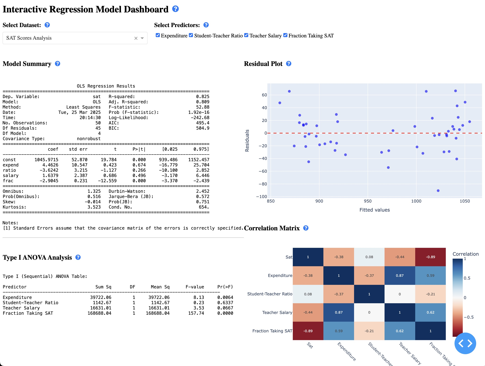
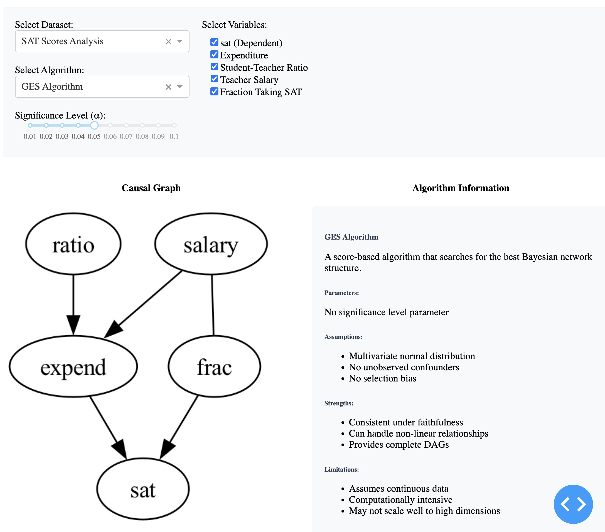

# Interactive Regression Analysis Dashboard

A powerful, interactive dashboard for performing and visualizing regression analysis on various datasets. Built with Dash and Python, this application provides an intuitive interface for exploring relationships between variables, conducting statistical analysis, and visualizing results.



## Features

- **Interactive Dataset Selection**: Choose from multiple pre-configured datasets
- **Dynamic Predictor Selection**: Select which variables to include in your regression model
- **Comprehensive Statistical Analysis**:
  - Full regression model summary with coefficients and statistics
  - Type I (Sequential) ANOVA analysis
  - Correlation matrix visualization
- **Visual Diagnostics**:
  - Residual plots for model validation
  - Interactive correlation heatmap
- **Interactive Data Table**:
  - Sort and filter capabilities
  - Multi-row selection
  - Pagination

## Installation

1. Clone this repository:
```bash
git clone <repository-url>
cd <repository-directory>
```

2. Install required dependencies:
```bash
pip install -r requirements.txt
```

## Usage

1. Start the dashboard:
```bash
python dash_mls.py
```

2. Open your web browser and navigate to:
```
http://localhost:8050
```

3. Using the dashboard:
   - Select a dataset from the dropdown menu
   - Choose predictors using the checklist
   - Examine the regression results in the left panel
   - Explore the visualizations in the right panel
   - Use the interactive data table at the bottom for detailed data exploration

## Data Configuration

The application uses a `config.yaml` file to manage datasets and their properties. Each dataset should be configured with:

```yaml
datasets:
  dataset_name:
    file: "path/to/data.csv"
    description: "Dataset Description"
    dependent_var: "target_variable"
    label_var: "label_column"
    predictors:
      - name: "predictor1"
        label: "Predictor 1 Label"
      - name: "predictor2"
        label: "Predictor 2 Label"
```

### Binary Variables
- Binary variables are automatically detected and converted to 0/1 encoding
- Binary predictors are marked with their reference category (e.g., "Sex (M=1)")

## Analysis Components

### 1. Regression Summary
- Displays comprehensive model statistics
- Shows coefficient estimates, standard errors, and p-values
- Includes R-squared, adjusted R-squared, and F-statistic

### 2. Type I ANOVA Table
- Shows sequential contribution of each predictor
- Includes:
  - Sum of Squares
  - Degrees of Freedom
  - Mean Square
  - F-value
  - p-value

### 3. Residual Plot
- Visualizes model residuals vs. fitted values
- Helps identify potential issues with model assumptions
- Interactive hover information for each point

### 4. Correlation Matrix
- Heatmap showing correlations between all variables
- Interactive visualization with exact correlation values
- Uses red-blue color scale for positive/negative correlations

## Architecture and Components

### Core Components

#### 1. Application Structure
- `dash_mls.py`: Main application entry point
- `config.yaml`: Dataset and configuration management
- `utils/`: Helper functions and utilities
  - `data_processing.py`: Data preprocessing and transformation
  - `statistics.py`: Statistical analysis functions
  - `visualization.py`: Plot generation utilities

#### 2. Data Flow
1. **Data Loading Layer**
   - YAML configuration parsing
   - Dataset loading and validation
   - Automatic type detection and conversion

2. **Processing Layer**
   - Data preprocessing and cleaning
   - Feature engineering
   - Statistical computations

3. **Visualization Layer**
   - Interactive Plotly components
   - Dynamic layout generation
   - Real-time updates

4. **UI Layer**
   - Dash components and callbacks
   - Layout management
   - User interaction handling

### Key Classes and Functions

#### DataManager
- Handles dataset loading and preprocessing
- Manages data transformations
- Provides data access to other components

#### RegressionAnalyzer
- Performs statistical analysis
- Generates model summaries
- Computes ANOVA tables

#### VisualizationManager
- Creates and updates plots
- Manages plot layouts
- Handles interactive features

### Callback Structure

The application uses a hierarchical callback structure:
1. **Dataset Selection Callbacks**
   - Update available predictors
   - Reset analysis state
   - Load new data

2. **Analysis Callbacks**
   - Update regression results
   - Generate visualizations
   - Compute statistics

3. **UI Interaction Callbacks**
   - Handle user selections
   - Update table views
   - Manage plot interactions

### State Management

- Uses Dash's built-in state management
- Maintains session-specific data
- Handles data persistence between callbacks

### Performance Considerations

- Implements lazy loading for large datasets
- Uses caching for expensive computations
- Optimizes plot rendering for large datasets

## Data Table Features

- **Filtering**: Filter rows based on any column value
- **Sorting**: Sort by multiple columns
- **Selection**: Select multiple rows for detailed examination
- **Pagination**: Navigate through large datasets easily

## Requirements

- Python 3.7+
- Dash
- Pandas
- NumPy
- Statsmodels
- Plotly
- PyYAML

## Contributing

1. Fork the repository
2. Create your feature branch
3. Commit your changes
4. Push to the branch
5. Create a new Pull Request


# Interactive Causal Discovery Dashboard

A powerful dashboard for performing causal discovery analysis using various algorithms. Built with Dash and Python, this application provides an intuitive interface for exploring causal relationships between variables using state-of-the-art causal discovery algorithms.




## Features

- **Multiple Causal Discovery Algorithms**:
  - PC Algorithm: Constraint-based learning for causal structure
  - FCI Algorithm: Handles unobserved confounders
  - GES Algorithm: Score-based Bayesian network learning
  - GRaSP Algorithm: Permutation-based sparse structure learning
- **Interactive Variable Selection**: Choose which variables to include in the analysis
- **Algorithm Information Panel**: Detailed explanation of each algorithm's:
  - Assumptions
  - Strengths
  - Limitations
  - Parameters
- **Visual Causal Graphs**: Clear visualization of discovered causal relationships
- **Interactive Data Table**: Explore the underlying data

## Usage

1. Start the dashboard:
```bash
python dash_cd.py
```

2. Open your web browser and navigate to:
```
http://localhost:8052
```

3. Using the dashboard:
   - Select a dataset from the dropdown menu
   - Choose an algorithm (GES is selected by default)
   - Select variables for analysis
   - Adjust the significance level (α) if needed
   - Examine the causal graph and algorithm information
   - Use the data table for detailed data exploration

## Algorithm Details

### PC Algorithm
- Constraint-based approach using conditional independence tests
- Fast and efficient for high-dimensional data
- Assumes no unobserved confounders
- Uses significance level (α) for independence testing

### FCI Algorithm
- Extension of PC that handles unobserved confounders
- Produces partial ancestral graphs
- More robust but computationally intensive
- Uses significance level (α) for independence testing

### GES Algorithm
- Score-based approach using Bayesian network learning
- Can handle non-linear relationships
- Assumes multivariate normal distribution
- No significance level parameter needed

### GRaSP Algorithm
- Permutation-based approach for sparse structure learning
- Robust to assumption violations
- Can handle non-linear relationships
- No significance level parameter needed

## Data Configuration

The application uses the same `config.yaml` file as the regression dashboard. Each dataset should be configured with:

```yaml
datasets:
  dataset_name:
    file: "path/to/data.csv"
    description: "Dataset Description"
    dependent_var: "target_variable"
    predictors:
      - name: "predictor1"
        label: "Predictor 1 Label"
      - name: "predictor2"
        label: "Predictor 2 Label"
```

### Data Processing
- Automatically handles missing values
- Converts binary variables to 0/1 encoding
- Ensures numeric data for analysis

## Architecture

### Core Components

#### 1. DataLoader
- Handles dataset loading and preprocessing
- Manages variable type detection and conversion
- Ensures data compatibility with selected algorithm

#### 2. CausalDiscovery
- Implements multiple causal discovery algorithms
- Handles graph visualization
- Manages algorithm-specific parameters

#### 3. Dashboard
- Coordinates all components
- Manages user interactions
- Provides algorithm information
- Handles layout and styling

### Callback Structure

1. **Dataset Selection**
   - Updates available variables
   - Resets analysis state
   - Loads new data

2. **Variable Selection**
   - Updates causal graph
   - Updates algorithm information
   - Maintains state consistency

3. **Algorithm Selection**
   - Updates visualization method
   - Updates parameter controls
   - Updates algorithm information 